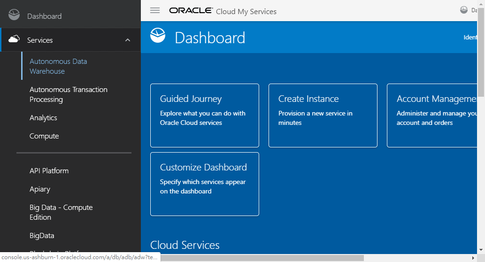
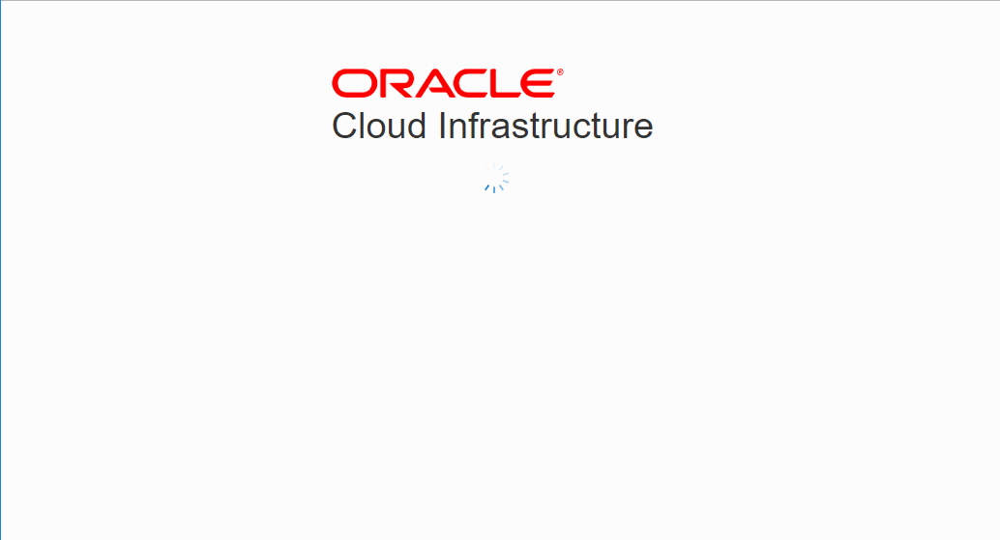
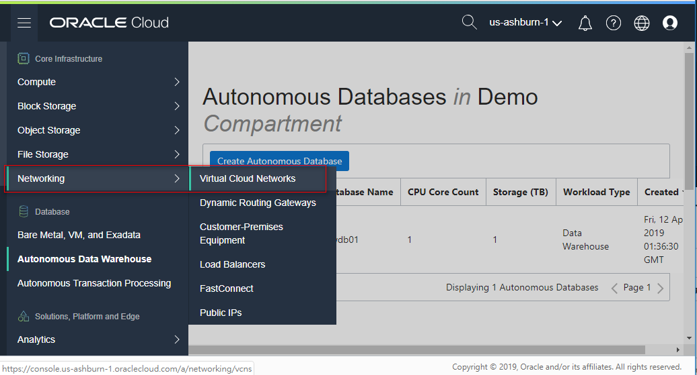
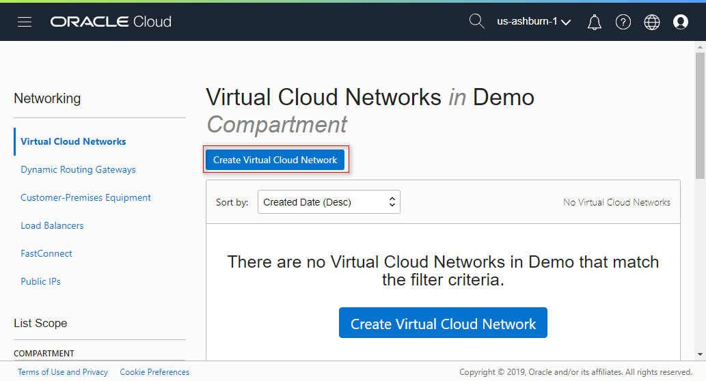
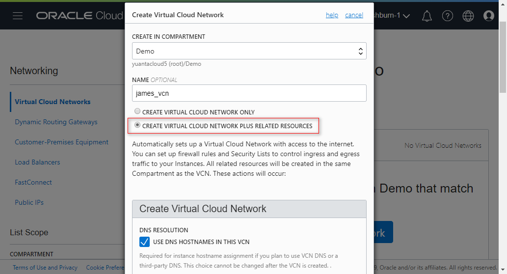
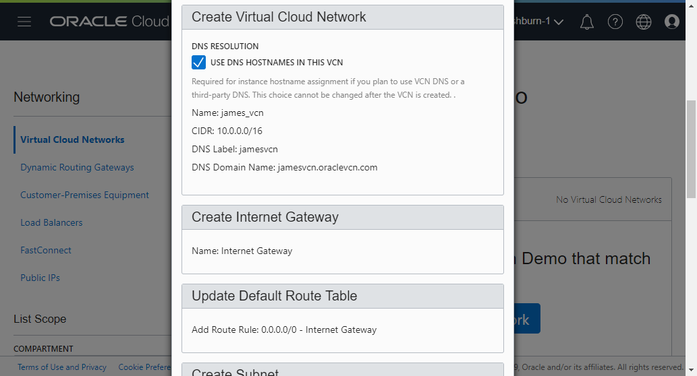
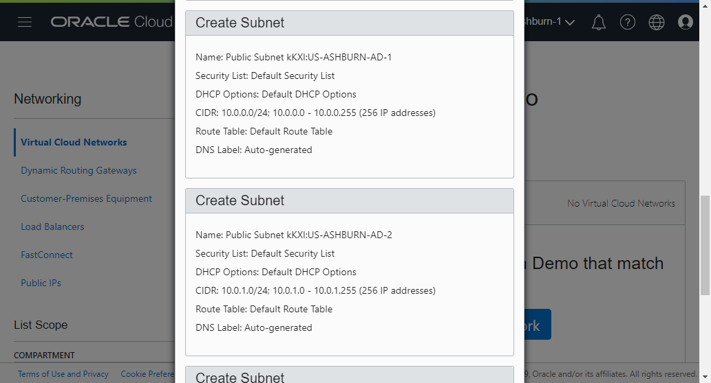
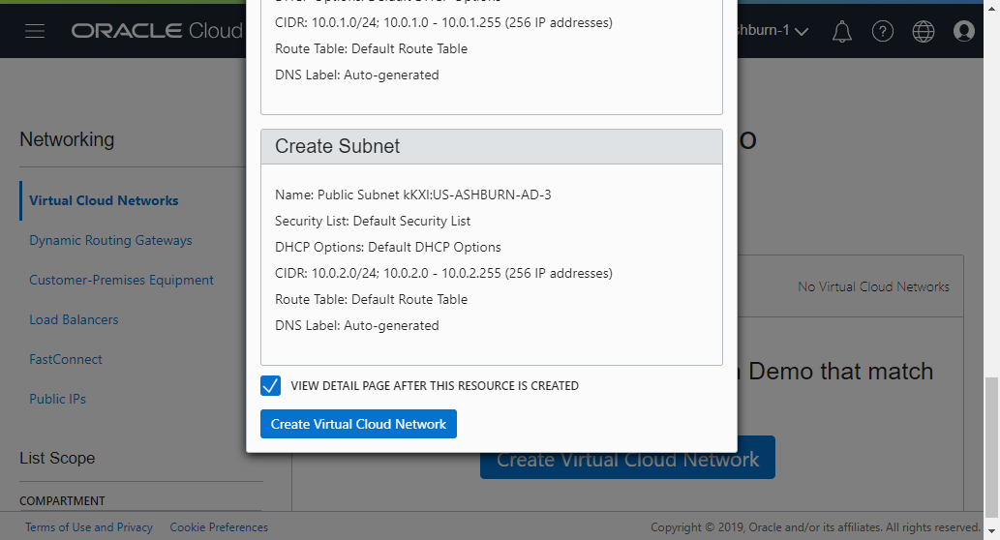

# 1 Creare Virtual Cloud Networks (VCN)

Login to Oracle Cloud My Service and go to "Service" and click "Autonomos Data Warehouse" to Oracle cloud infrastructure(Core Infrastructure).

Under Core Infrastructure, go to Networking and click Virtual Cloud Networks.

Select "Create Virtual Cloud Network Plus Related Resources."

