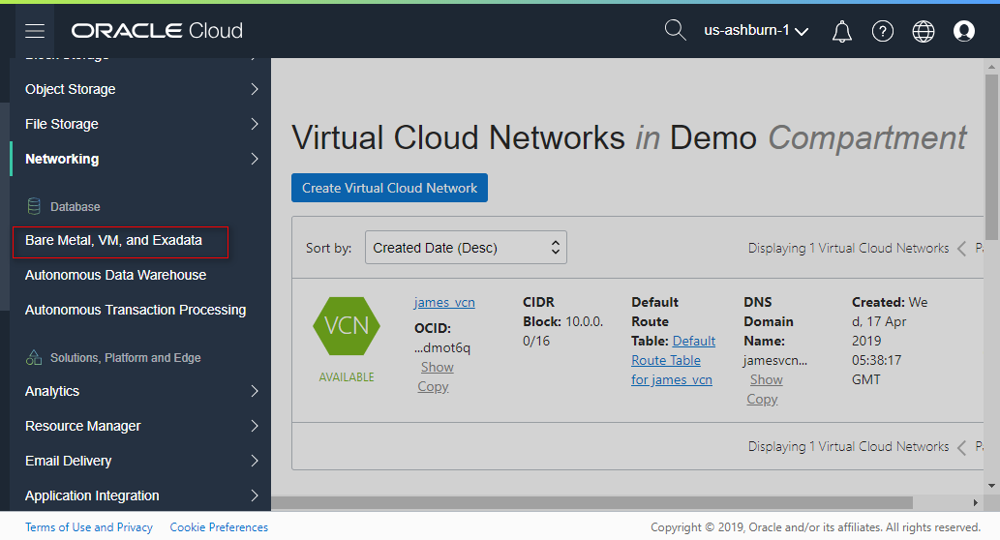
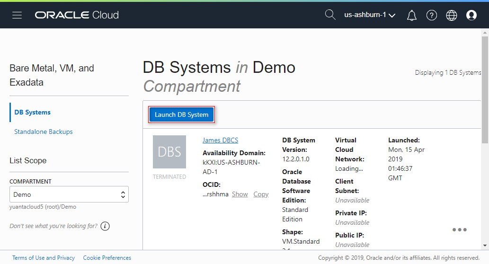
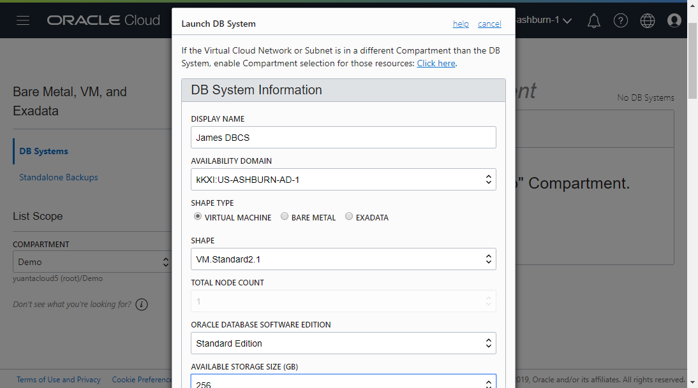
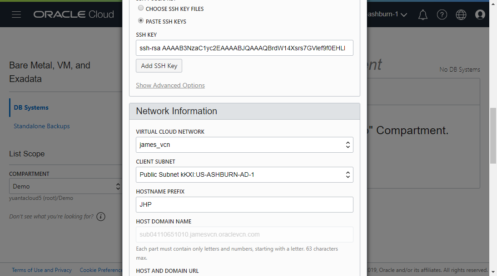
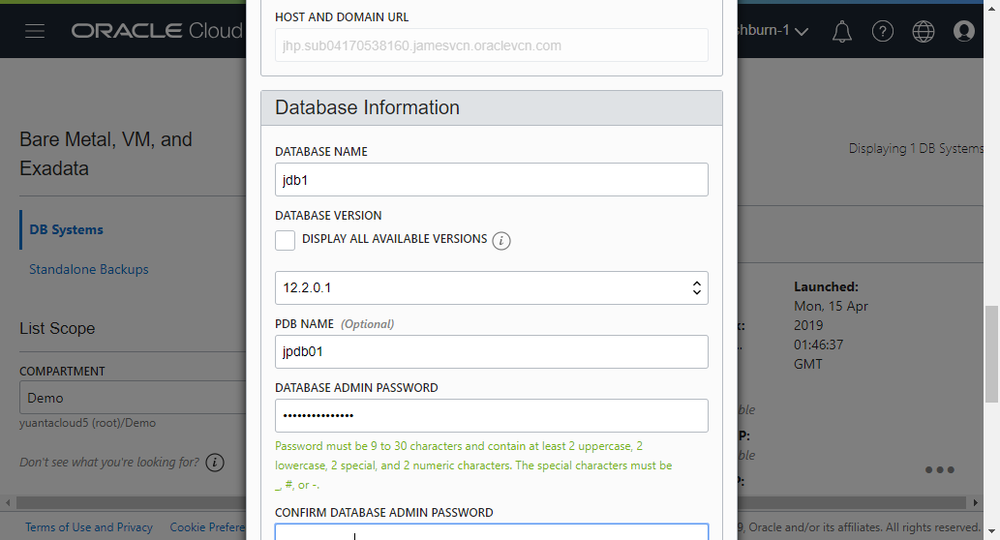
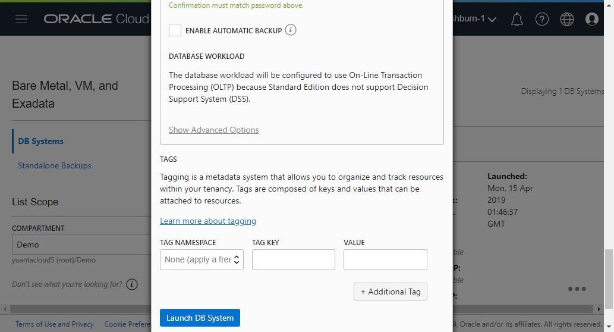
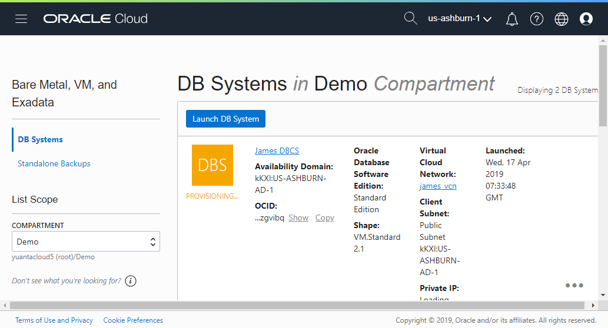

# 2 Creare Database Cloud Service (DBCS)

## Requirements
Before create Oracle Database Cloud Service (DBCS). You must be setup a VCN and other VCN components.
* [1-Creare_Virtual_Cloud_Networks_(VCN)](../1-Creare_Virtual_Cloud_Networks_(VCN))

## References
* [Oracle Database Offerings in Oracle Cloud Infrastructure](https://blogs.oracle.com/cloud-infrastructure/oracle-database-offerings-in-oracle-cloud-infrastructure)    
* [Release Schedule of Current Database Releases (Doc ID 742060.1)](https://support.oracle.com/knowledge/Oracle%20Database%20Products/742060_1.html)
* [Compute Shapes](https://docs.cloud.oracle.com/iaas/Content/Compute/References/computeshapes.htm)

## Action  

Login to Oracle Cloud My Service and go to "Service" and click "Autonomos Data Warehouse" to Oracle cloud infrastructure(Core Infrastructure).

Under Core Infrastructure. go to Database and click "Bare Metal , VM, and Exadata."

資料庫可以部署在VM、Bare Metal（物理機）和Exadata上。  
    - 如果是部署在物理機上，則支援兩種Shape，只支援單節點，不支援RAC。  
    - 如果是部署在VM上，支援單節點和兩節點RAC。  
    - 如果是部署在Exadata上，則每一個數據庫節點都是一個虛擬機器。並且支援大於兩個節點的RAC。  

SSH KEY :  
    1. Using PuTTYgen on to generate SSH key.    
    2. Save public key and private key in different files.  
    3. PASTE the public key into the text box.  

