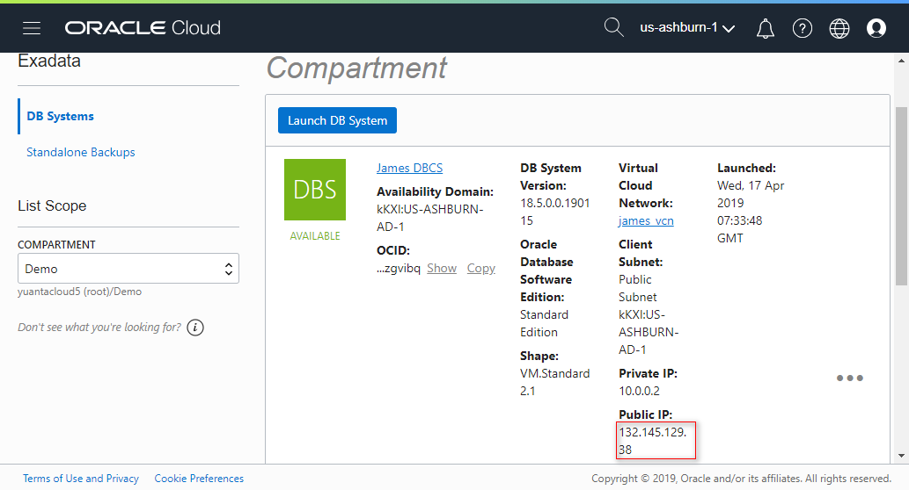
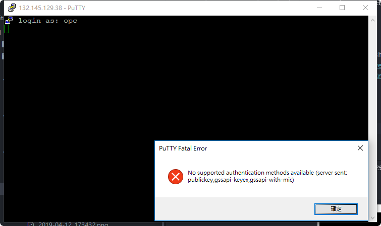
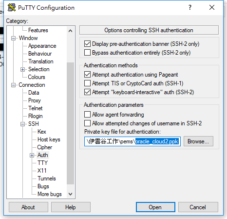
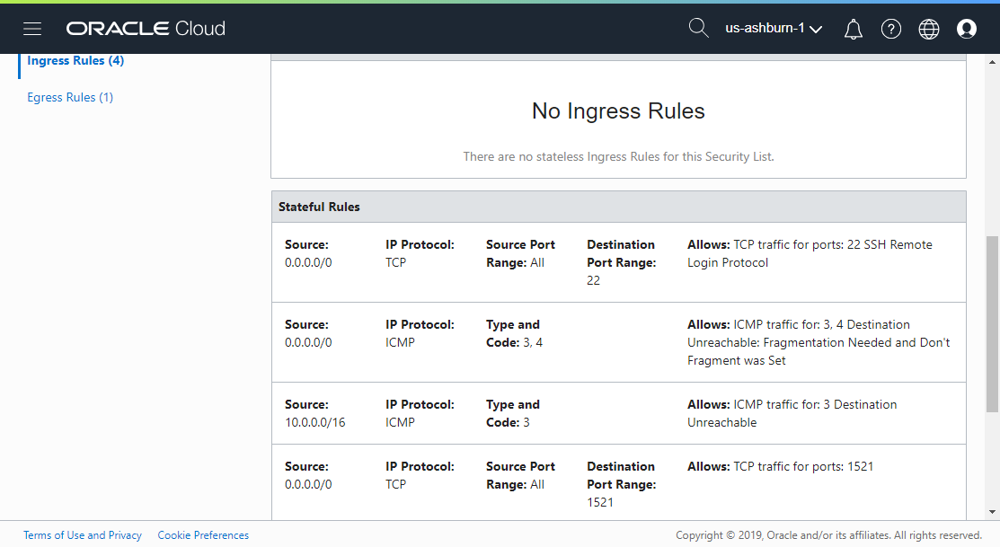
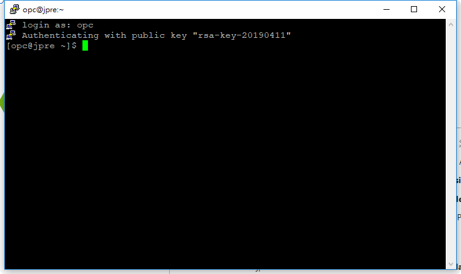

# 3 Connect to DBCS usgin PuTTY

## Requirements  

Before connect to DBCS os. You must have to finished the following steps.
* [2-Create_Database_Cloud_Service_(DBCS)](../2-Create_Database_Cloud_Service_(DBCS))

## Action  

  

default account : opc  
  

The private key file you has been saved in step 2. (2-Create_Database_Cloud_Service_(DBCS))  
  

在 Default Security List. 需允許 ports 22.

