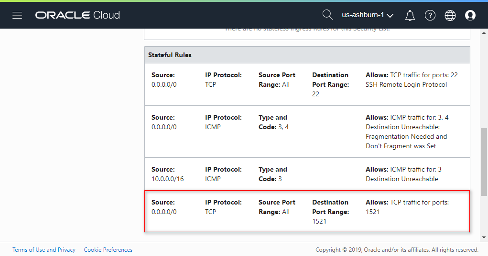
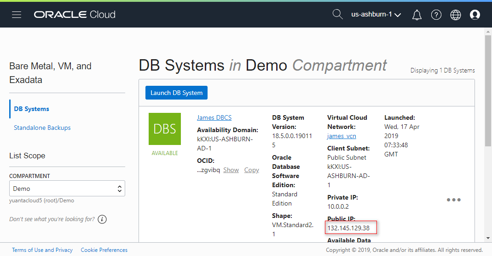
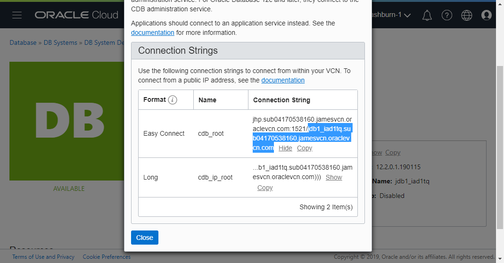
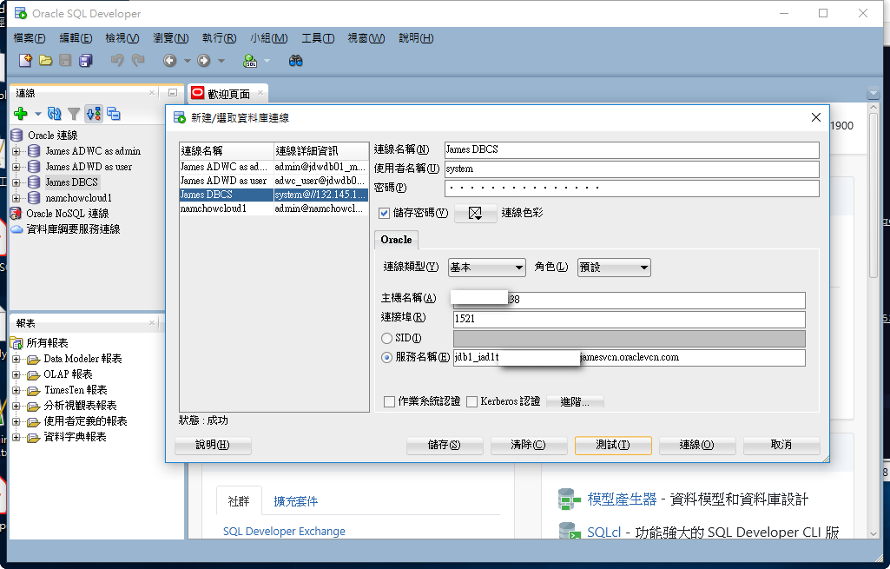

# 4 Connect DBCS using sqldeveloper.    

## Requirements  
Before connect to DBCS os. You must have to finished the following steps.
* [2-Create_Database_Cloud_Service_(DBCS)](../2-Create_Database_Cloud_Service_(DBCS))

## Steps
[1. Add ingress rule](#1-add-ingress-rule)    
[2. Note the public IP and db service name](#2-note-the-public-IP-and-db-service-name)    
[3. Connect DBCS using sqldeveloper](#3-connect-dbcs-using-sqldeveloper)    

## Action  

### 1. Add ingress rule
Edit Security List Rules. Add ingress rule.
  

### 2. Note the public IP and db service name
  

  

### 3. Connect DBCS using sqldeveloper
密碼為建立DBCS時所設定的 Database admin password.

