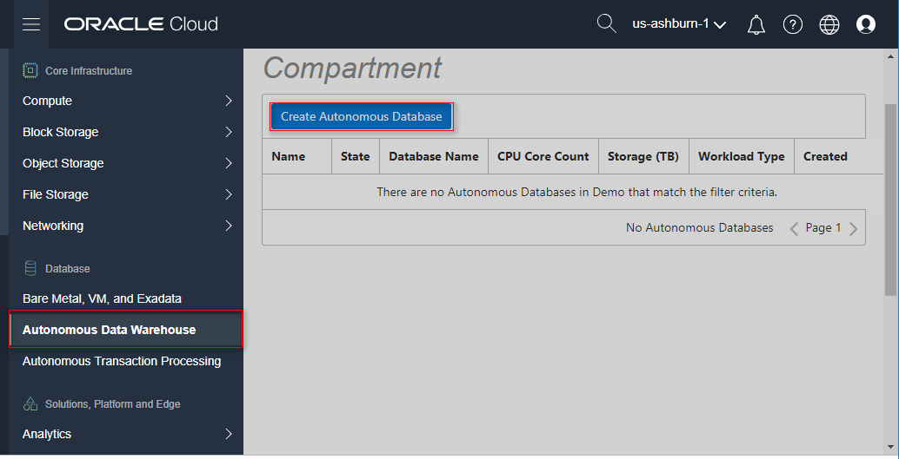
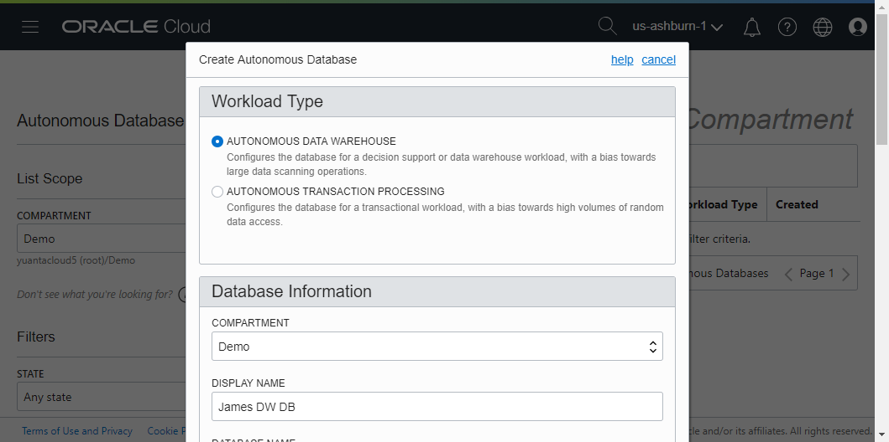
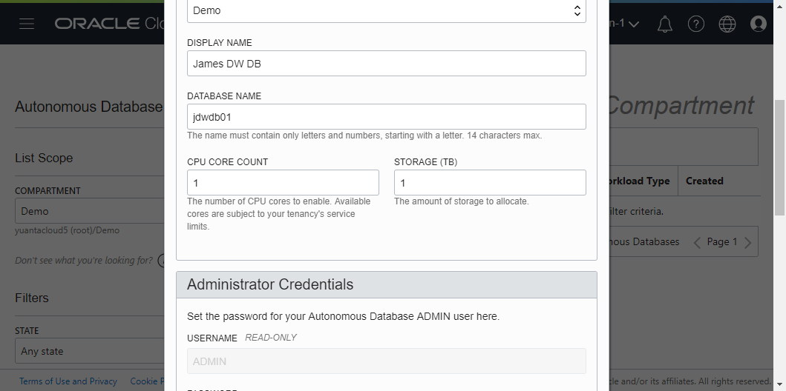
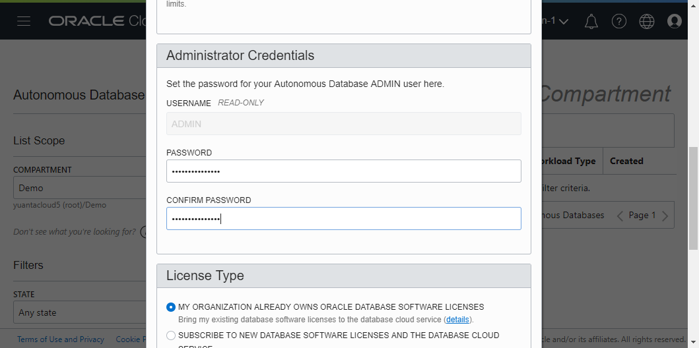
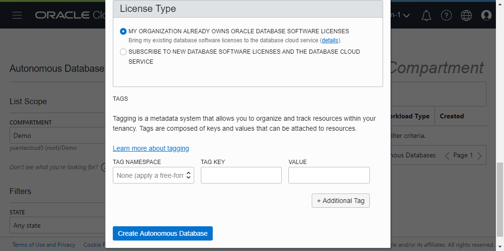

# 5 Creare Autonomos Data Warehouse (ADW)

## Requirements  
Before create Oracle Database Cloud Service (DBCS). You must be setup a VCN and other VCN components.

* [1-Creare_Virtual_Cloud_Networks_(VCN)](../1-Creare_Virtual_Cloud_Networks_(VCN))

## Action  

Login to Oracle Cloud My Service and go to "Service" and click "Autonomos Data Warehouse" to Oracle cloud infrastructure(Core Infrastructure).

Under Core Infrastructure. go to Database and click "Autonomos Data Warehouse"

AWD 是以PDB的形式存在，只有提供受限制的 admin 管理帳號。

