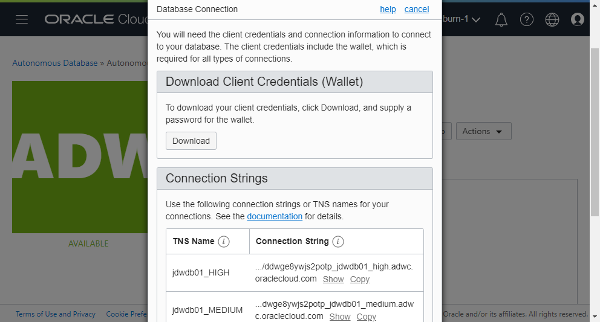
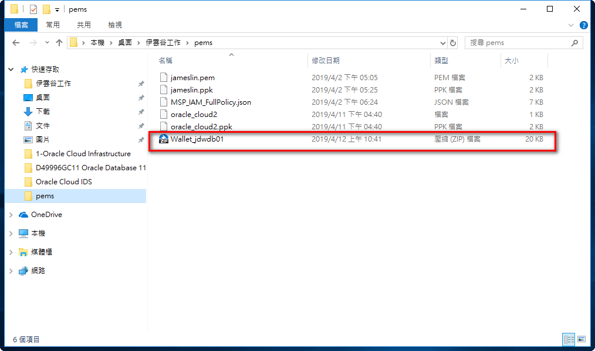
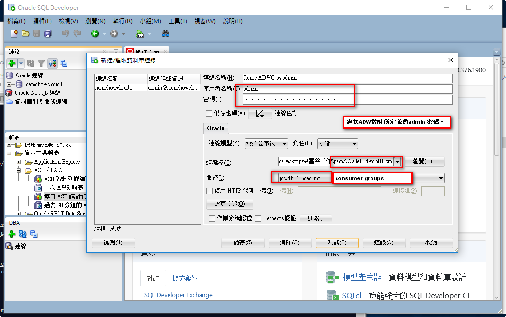

# 6 Connect to ADW using Sqldeveloper

## Requirements  
Before connect to ADW using Sqldeveloper. You must have to finished the following steps.

* [5-Create_Autonomos_Data_Warehouse_(ADW)](../5-Create_Autonomos_Data_Warehouse_(ADW)))

## Action  

AWD 是以PDB的形式存在，只有提供受限制的 admin 管理帳號，密碼在建立ADW時所自行定義的密碼。

