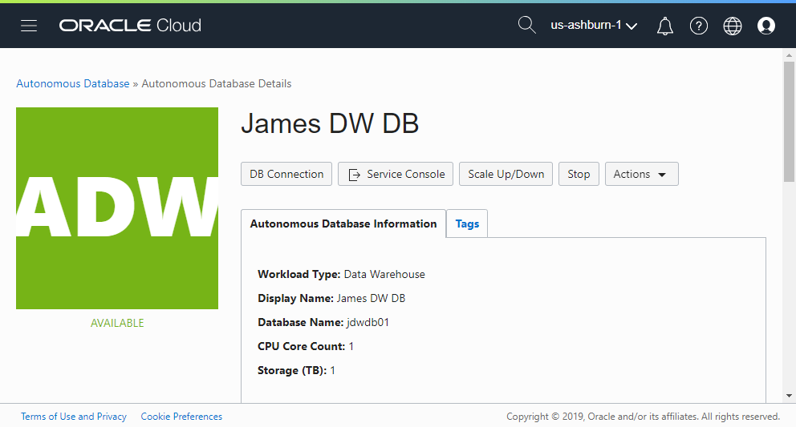
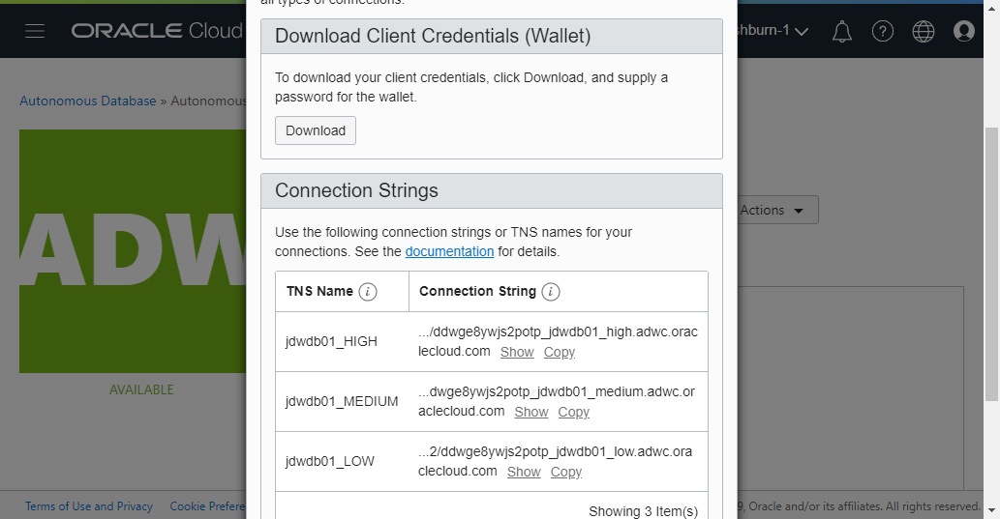
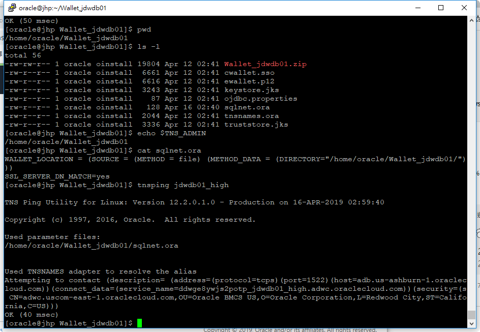
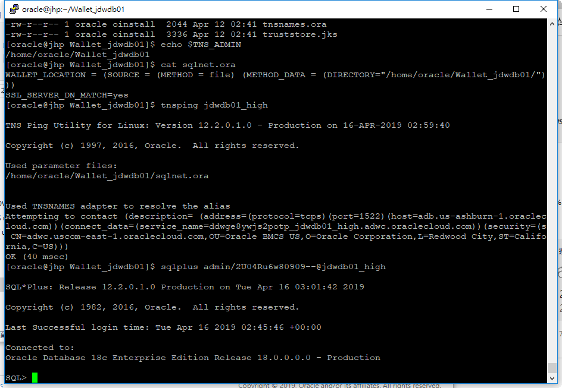

7 Connect to ADW using SQL*Plus
=====================

## Requirements  
Before connect to ADW using Sqldeveloper. You must have to finished the following steps.

* [5-Create_Autonomos_Data_Warehouse_(ADW)](../5-Create_Autonomos_Data_Warehouse_(ADW)))  
* 一台已經安裝好 Oracle Client 的主機。

## Action  

* 登入已經安裝好Oracle Client 主機。
* 將 Wallet 上傳到該主機並解壓縮。
* sqlnet.ora 中 WALLET_LOCATION 的 DIRECTORY=<解壓的Wallet目錄>
* export TNS_ADMIN=<解壓的Wallet目錄>
* cat tnsnames.ora 查詢可用的連線資訊

PS : 如果無法設定 TNS_ADMIN 變數，可以將 Wallet 中的檔案放置到 %ORACLE_HOME/network/admin 目錄底下。
