8 Create schema and load the sample data.
====================


## Requirements  
Before Create schema and load the sample data. You must have to finished the following steps.
* [6-Connect_to_ADW_using_SQL_Developer](../6-Connect_to_ADW_using_SQL_Developer)

## Steps  
[1. Create Users with Autonomous Data Warehouse](#1-create-users-with-autonomous-data-warehouse)    
[2. Create table](#2-create-table)    
[3. Export data from sh (sales history)](#3-export-data-from-sh-sales-history)    
[4. Upload data to object storage.](#4-upload-data-to-object-storage)    
[5. Create an Auth Token](#5-create-an-auth-token)    
[6. Create Object Store Credentials in new_user Schema](#6-create-object-store-credentials-in-new_user-schema)    
[7. Copy Data from Object Store to Autonomous Data Warehouse Database Tables](#7-copy-data-from-object-store-to-autonomous-data-warehouse-database-tables)    

## Action 

#### 1. Create Users with Autonomous Data Warehouse

As the ADMIN user run the following SQL statement:

```SQL
--- create normal user
CREATE USER <new_user> IDENTIFIED BY "<passowrd>";
GRANT create session , resource, connect TO <new_user>;
GRANT dwrole TO <new_user>; -- ADW admin user , dbms_cloud 會用到此權限。
ALTER USER <new_user> QUOTA UNLIMITED ON <tablespace_name>;
```

The privileges in DWROLE are the following:
```
CREATE ANALYTIC VIEW
CREATE ATTRIBUTE DIMENSION
ALTER SESSION
CREATE HIERARCHY
CREATE JOB
CREATE MINING MODEL
CREATE PROCEDURE
CREATE SEQUENCE
CREATE SESSION
CREATE SYNONYM
CREATE TABLE
CREATE TRIGGER
CREATE TYPE
CREATE VIEW
UNLIMITED TABLESPACE
READ,WRITE ON directory DATA_PUMP_DIR
EXECUTE privilege on the PL/SQL package DBMS_CLOUD
```
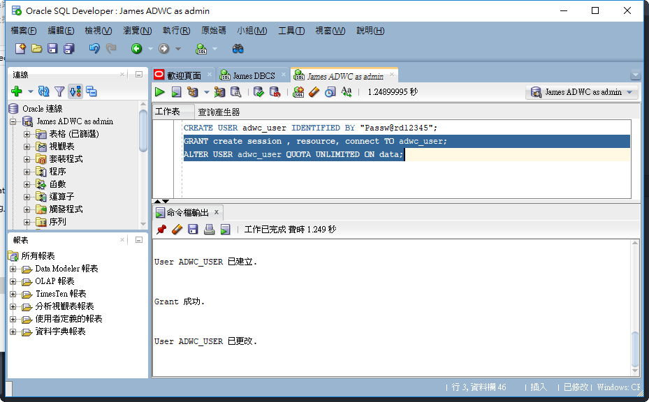

#### 2. Create table
As the new_user. Paste the [Create_SH_Tables](./create_sh_tables.txt) to SQL Developer and run script to create sh tables.

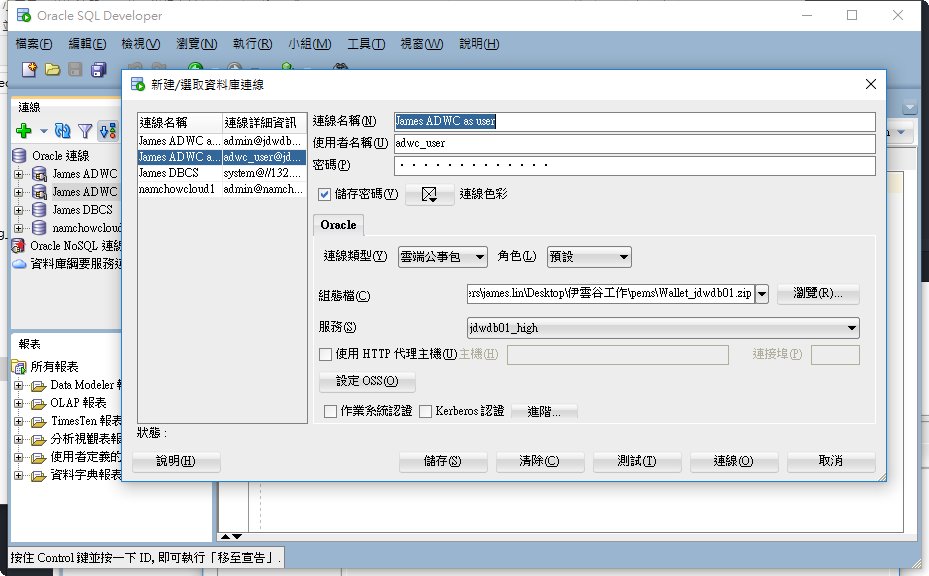

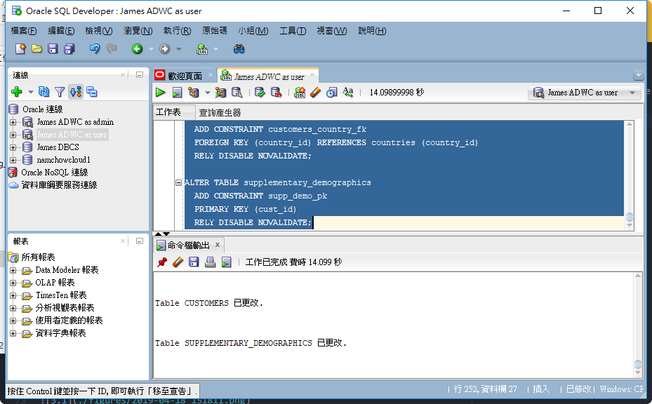

### 3. Export data from sh (sales history)

As the new_user login database using sqldeveloper:

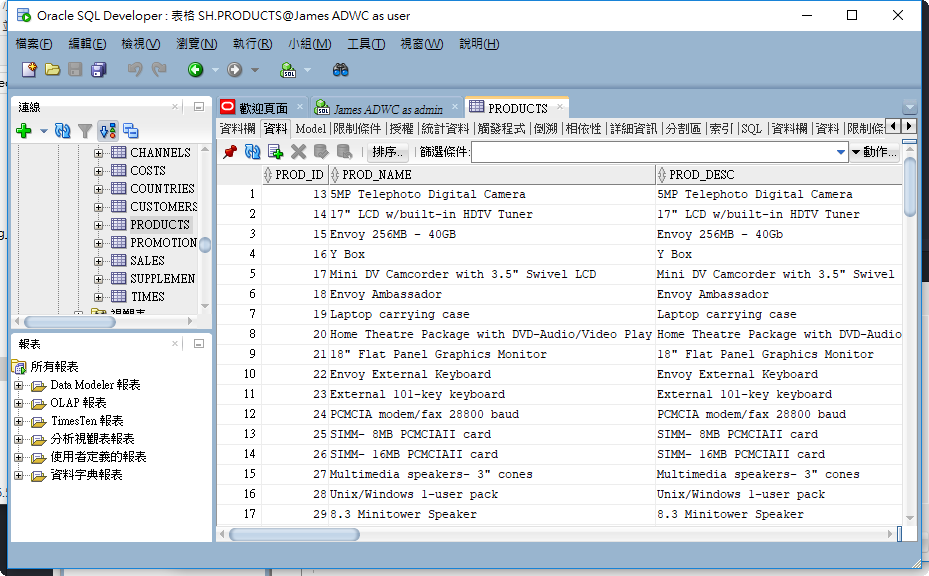

導出前要注意日期格式    
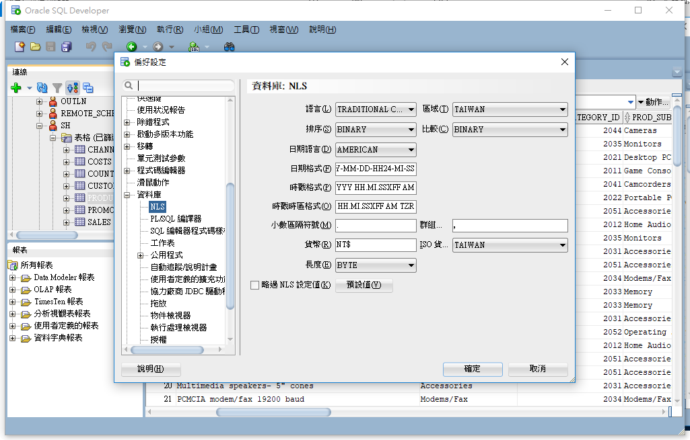

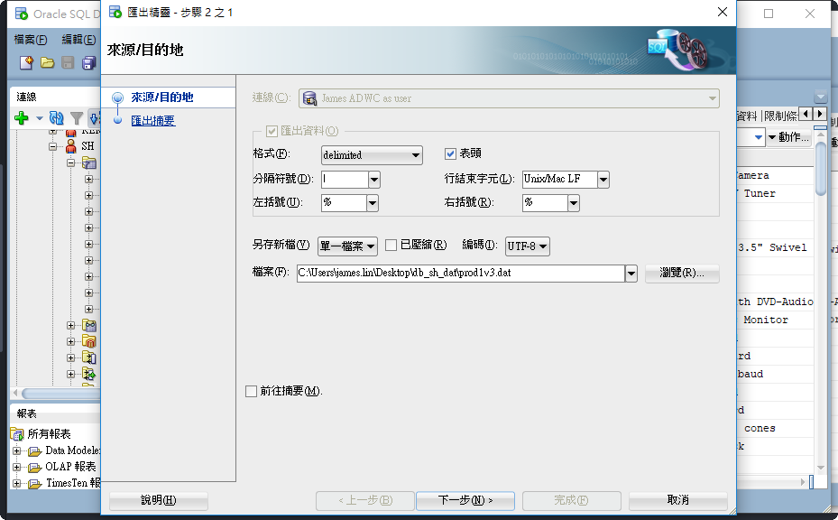

倒出資料檢查格式是否正確    


All sales history table data : [all_sh_talbe_dat.zip](./all_sh_talbe_dat.zip)

### 4. upload data to object storage.

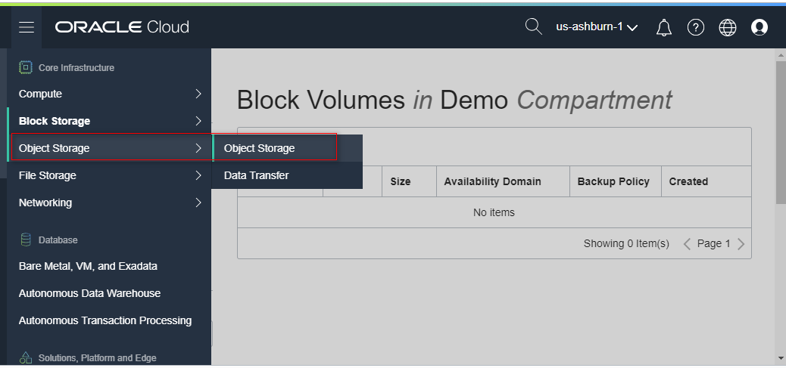

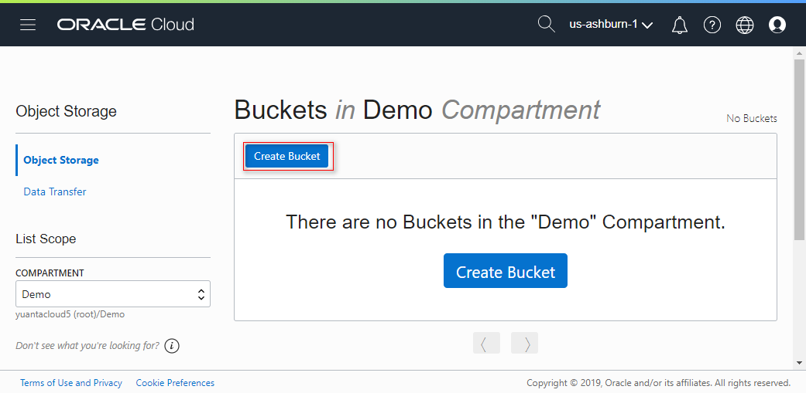

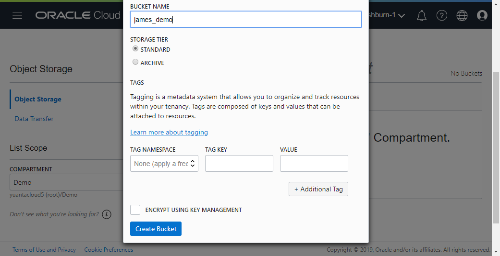

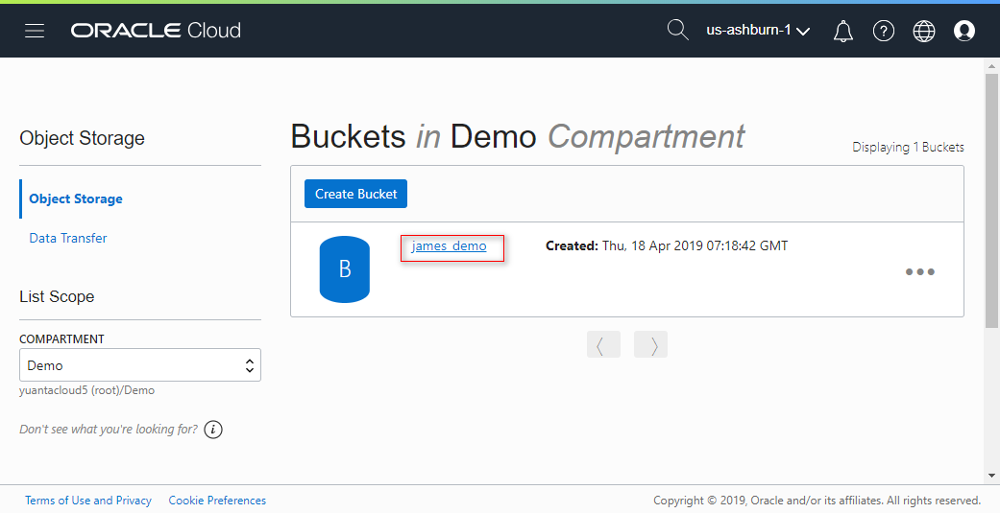

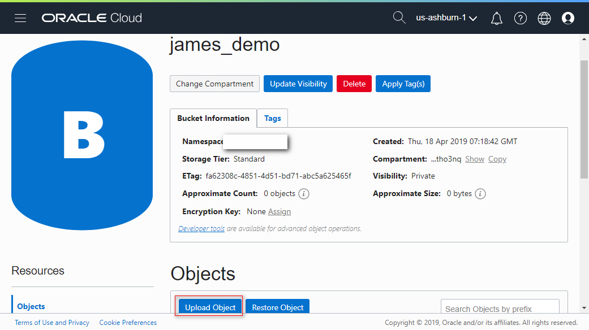

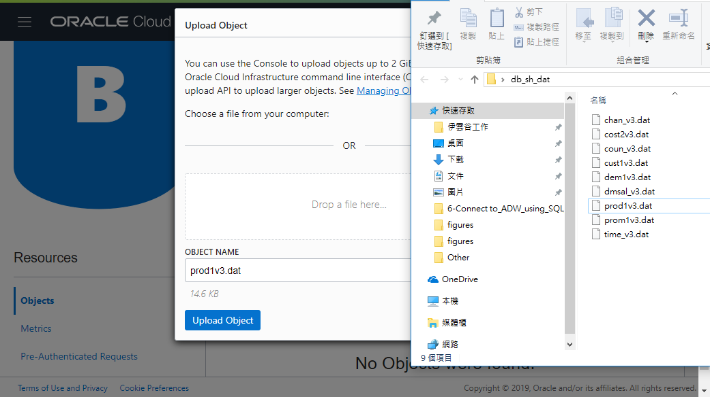

All sales history table data : [all_sh_talbe_dat.zip](./all_sh_talbe_dat.zip)

### 5. Create an Auth Token
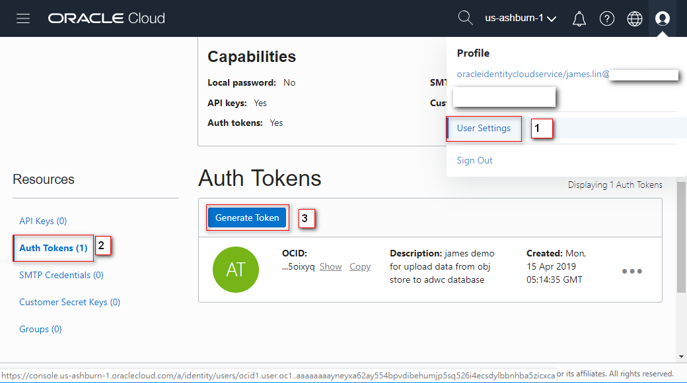

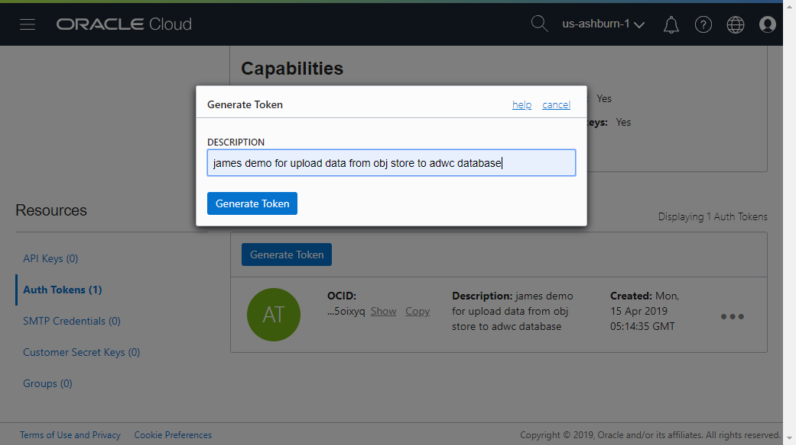

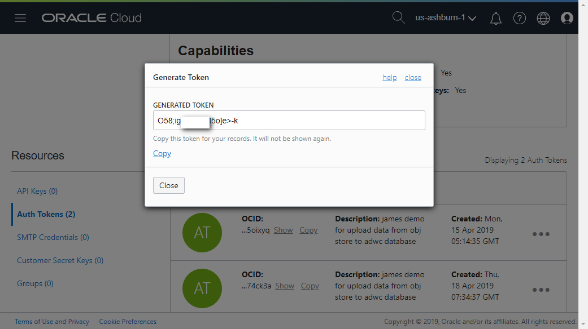

### 6. Create Object Store Credentials in new_user Schema
In a SQL Developer worksheet
```SQL
begin
  DBMS_CLOUD.create_credential (
    credential_name => 'OBJ_STORE_CRED',
    username => 'oracleidentitycloudservice/< your name >@<your domain>.com',
    password => '<D1JcMqHaxxxkq-g2;Ft'
  ) ;
end;
/
```

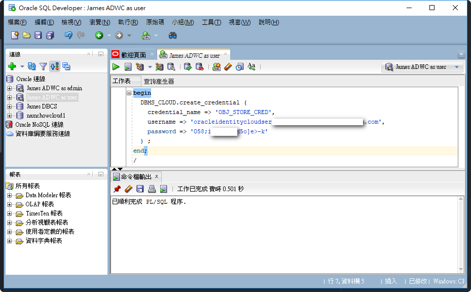

### 7. Copy Data from Object Store to Autonomous Data Warehouse Database Tables
```sql
begin
 dbms_cloud.copy_data(
    table_name =>'PRODUCTS',
    credential_name =>'<Your credential name>',
    file_uri_list =>'<Your FILE_URI_LIST>',
    format => json_object('delimiter' value '|', 'quote' value '%', 'ignoremissingcolumns' value 'true', 'dateformat' value 'YYYY-MM-DD-HH24-MI-SS', 'blankasnull' value 'true')
 );
end;
/
```
All sales history example script : [load_data_script.txt](./load_data_script.txt)

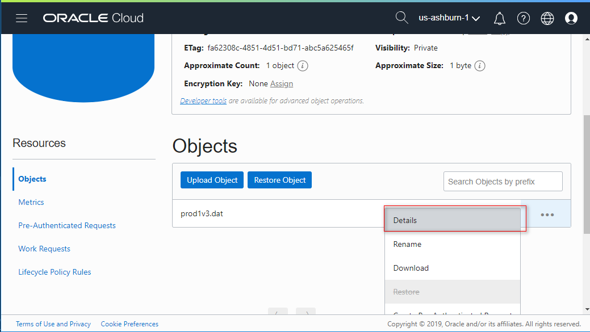

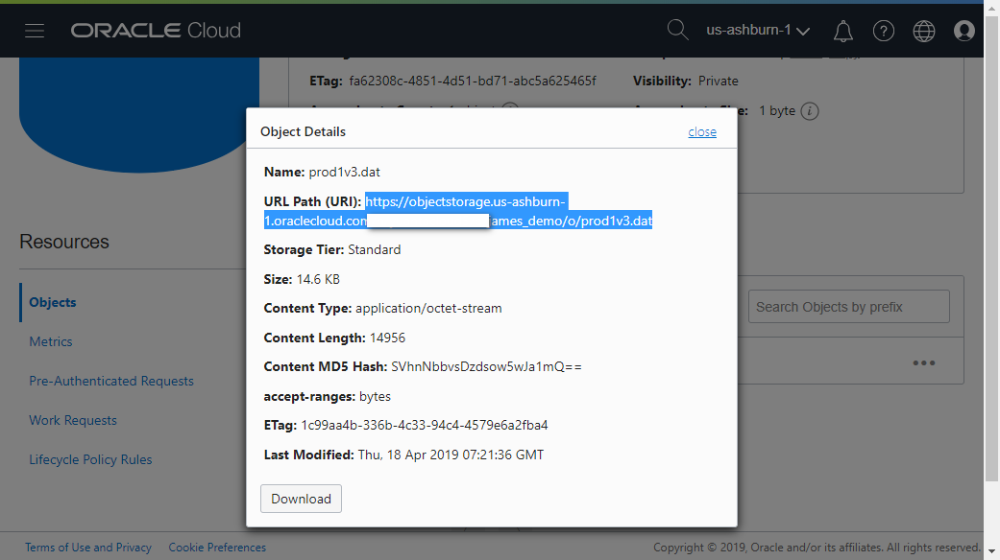

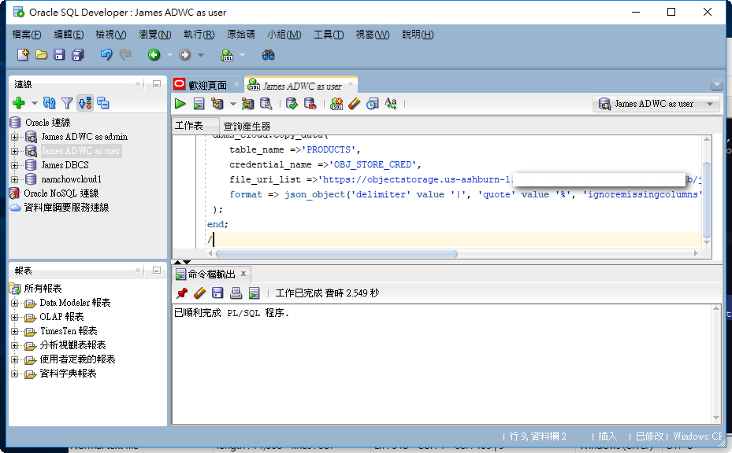
